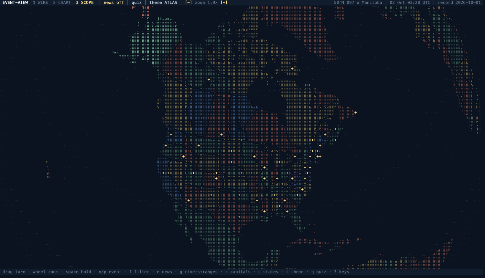
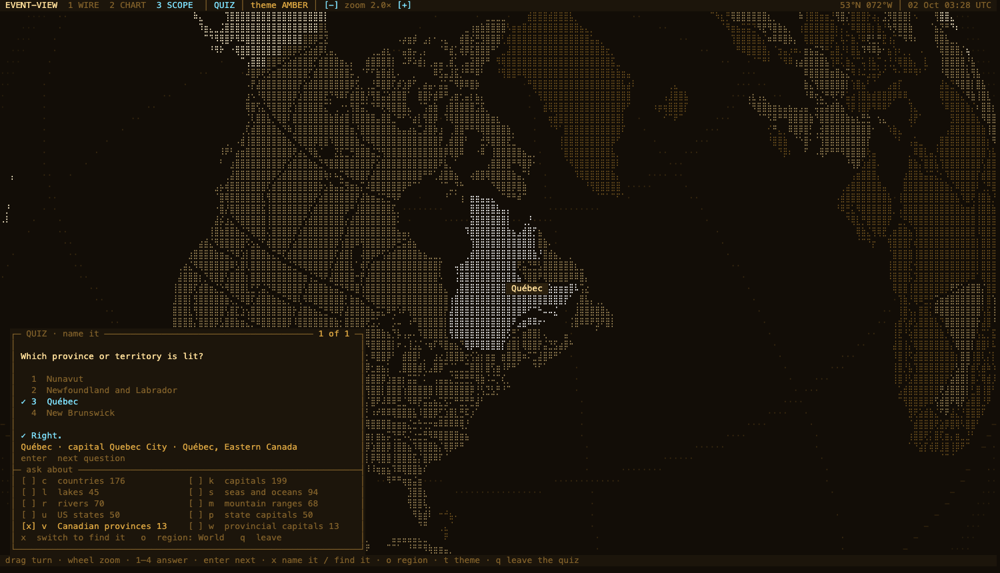

# event-view

Current events and a geography quiz on a rotating globe drawn entirely in text. Everything on screen is one grid of monospace characters: the globe, the panels, the labels.





## Run it

Needs `zsh`, Python 3 and a browser. Nothing to install.

```sh
./event-view on      # serve this folder on 127.0.0.1:8377 and open the page
./event-view off     # stop
./event-view         # status
./event-view on quiz # open straight into the quiz
```

Link the script into a directory on your `PATH` to call it as `event-view` from anywhere. The server binds to this machine only. Set `EVENT_VIEW_PORT` to change the port.

## What it does

- **Three modes** (`1` `2` `3`): WIRE puts the globe in the middle with events on leader lines to both margins. CHART fills every country with its own name and adds a gazetteer panel. SCOPE is a full-window braille globe with labels on the map, and is the default.
- **Six color themes** (`t`): AMBER, NAVY, PAPER, TERMINAL, and ATLAS and ATLAS LIGHT, which give each country its own color so that no two neighbors match.
- **Events** from `events.json`, pinned where they happen, with the day and night sides from the real clock.
- **Geography quiz** (`q`) over countries, capitals, lakes, seas, rivers, mountain ranges, US states and state capitals, Canadian provinces and their capitals. Two ways of asking: *name it* lights a feature and offers four names; *find it* gives a name and waits for a click. Wrong choices come from the nearest features of the same kind, and missed items come back more often.
- **Layers**: rivers and ranges (`g`), capitals (`c`), US states and Canadian provinces (`s`), their capitals (`C`), all news off (`e`).

Press `?` in the page for the full key list. Drag turns the globe; the wheel or `+` `-` zooms.

## Your events

`events.json` is yours and is not tracked by git. The first `event-view on` copies `events.example.json` into place. The page re-reads the file every 15 seconds, so it can be edited while the page is open.

```json
{
  "updated": "2026-10-01",
  "focus": [],
  "events": [
    {
      "id": "cop31-antalya",
      "title": "COP31 in Antalya",
      "date": "2026-11-09",
      "end": "2026-11-20",
      "status": "upcoming",
      "cat": "climate",
      "place": "Antalya, Turkey",
      "lat": 36.9,
      "lon": 30.7,
      "iso": "TUR",
      "also": ["AUS"],
      "sum": "One or two sentences.",
      "tag": "web-verified",
      "src": "where this came from",
      "region": "middle-east"
    }
  ]
}
```

| Field | Values |
|---|---|
| `status` | `live` (happened, still developing), `upcoming`, `watch` (a standing situation) |
| `cat` | `conflict`, `economy`, `finance`, `logistics`, `production`, `space`, `tech`, `politics`, `climate` |
| `date` | `YYYY-MM-DD`, or `YYYY-MM` when the day is not known |
| `iso`, `also` | ISO 3166-1 alpha-3 codes; `iso` is the country that gets tinted |
| `title` | 58 characters at most; `sum` 260 at most |

`event-view focus ID...` marks events as in discussion: the page flies to the first and flags them. `event-view focus` clears the marks. `event-view ids TEXT` finds an id.

## Map data

All map data is from [Natural Earth](https://www.naturalearthdata.com/), which is in the public domain, and is committed here already built.

| File | What |
|---|---|
| `land.bin`, `countries.json` | Quarter-degree raster of countries (1:110m), names, capitals |
| `water.bin`, `relief.bin`, `features.json` | Seas and lakes, mountain ranges, rivers (1:50m) |
| `states.bin`, `states.json` | US states and Canadian provinces and territories (1:50m), their capitals (1:10m) |

The scripts in `tools/` rebuild them from the Natural Earth GeoJSON files and need `numpy` and `Pillow`. The lists of which lakes, rivers and ranges count as major are at the top of `tools/build_features.py`. The Strait of Hormuz and Bab-el-Mandeb are drawn by hand there, since the source set does not name them.

## Limits

- The country map is the coarse 1:110m set, so about twenty very small states have a capital but no land of their own, and a point on a border can resolve to the neighbor.
- A few seas are filed under the nearer continent for the quiz's continent filter.
- The page is drawn on a canvas, so the text is not selectable.

## License

The code is under the MIT License; see `LICENSE`. The map data is Natural Earth's and is in the public domain.
